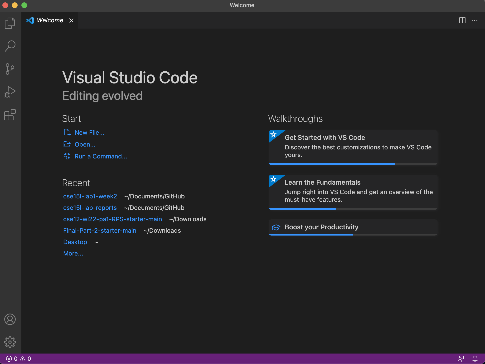
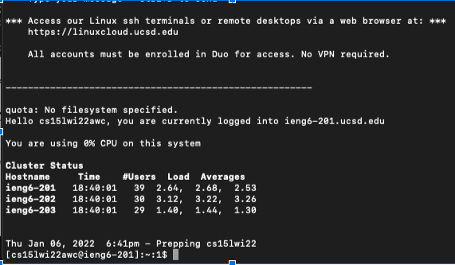
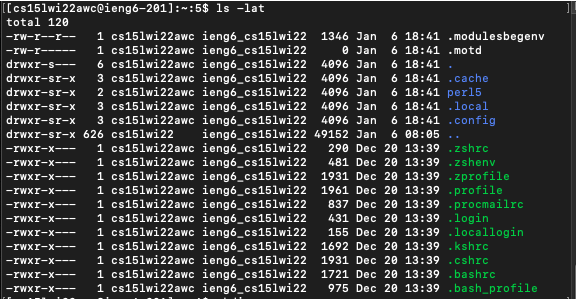
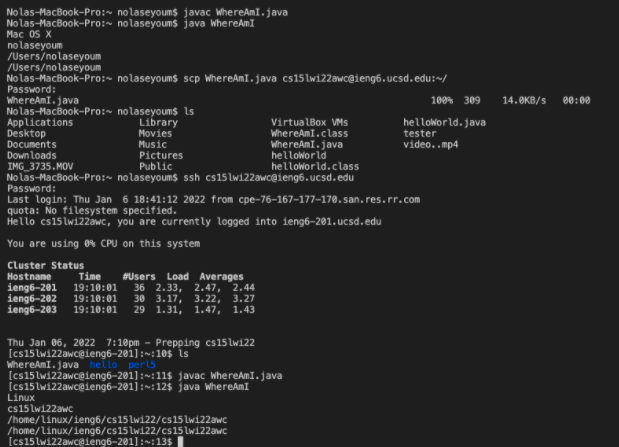
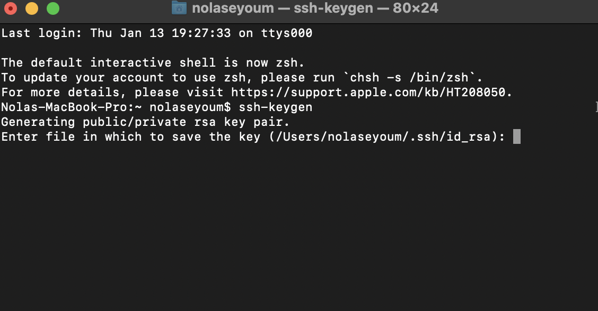
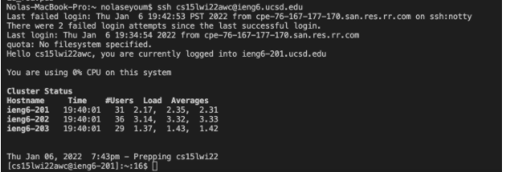

**Installing VS Code**

• Go to the Visual Studio Code website and locate the download link for your respective OS
• Find where the download was stored and open it, which should open the VS Code home page

**Remotely Connecting**

• First install OpenSSH, a program that allows your computer to connect to other computers that also have SSH downloaded
• Then open a terminal either on your computer or in VS Code and type in 
ssh cs15lwi22zz@ieng6.ucsd.edu
with your account specific three letters replacing the "zz"
• If a message appears questioning the authenticity of the host, click yes and then enter your password to successfully log in 

**Trying Some Commands**

• To run a command, just enter the command and hit enter on either your computer or the remote one
• Some example commands are cs ~, cd, ls -lat, and ls -a

**Moving Files with scp**

• To move a file, create a file on your computer and run it using javac and java
• Open the terminal and run the following command and enter your password when prompted
scp <filename.java> cs15lwi22zz@ieng6.ucsd.edu:~/
• Log into the remote computer using ssh and use ls to see the file in the directory, allowing you to run the file now

**Setting an SSH Key**

• First type in ssh-keygen and enter the file to save the key /Users/<computername>/.ssh/id_rsa
• Hit enter when prompted for the passphrase and enter again to confirm the password
• A statement saying your indentification and public key has been saved in the file will then appear, meaning you've successfully set the key

**Optimizing Remote Running**

• There are different ways to optimizie remote running
• One is by writing the command in quotes, which will then close the remote server after the command runs
• Use the up arrows to recall the last command that was called instead of retyping it

