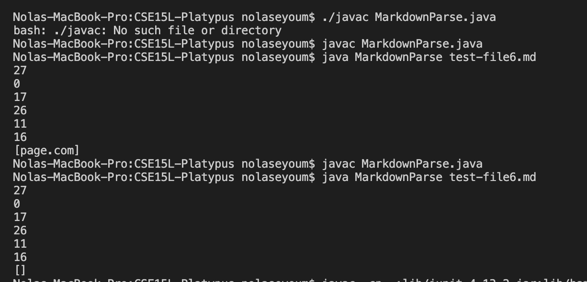

**Code Change 1**

[Link to test-file6 that caused error](https://github.com/nseyoum/CSE15L-Platypus/blob/main/test-file6.md)

In the test file, the link to the website was not valid because it had an exclamation point infront of the square bracket, indicating that it was an image rather than a URL. When the program ran however, it printed out the code in the paranthesis as a website URL rather than printing an empty array.

**Code Change 2**

[Link to test-file6 that caused error](https://github.com/nseyoum/CSE15L-Platypus/blob/main/test-file6.md) 

When we initially tested test-file6, there was only one potential website URL so we added another test case, which caused it to fail again. Once the program found an exclamation point it returned whatever was stored in the toReturn array at that moment, rather than checking the rest of the file. In our test file, we had a valid website URL found after an invalid one but the program returned an empty array.

**Code Change 3**

[Link to test-file8 that caused error](https://github.com/nseyoum/CSE15L-Platypus/blob/main/test-file8.md)

The first change made fixed the initial bug but in doing so caused an out of bounds error. The program would check for an exclamation point one index before the index of the open square bracket but if that index equaled 0 it created an out of bounds error. In test-file8, the first open square bracket was found at index 0, causing an index out of bounds error.
