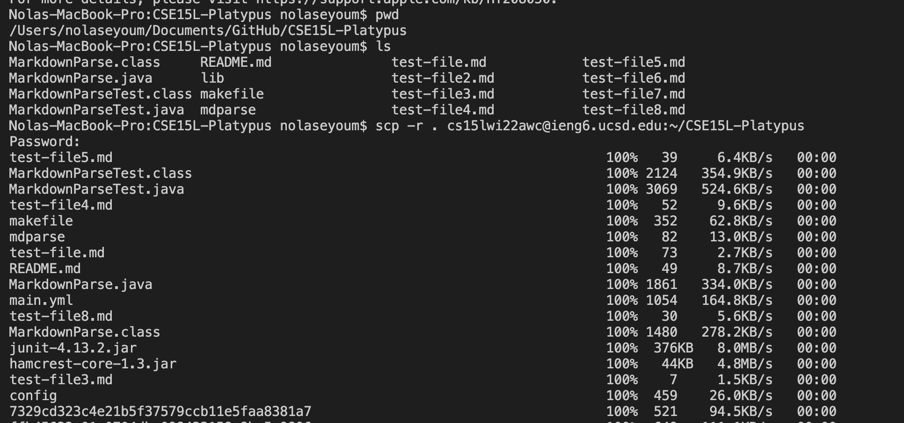
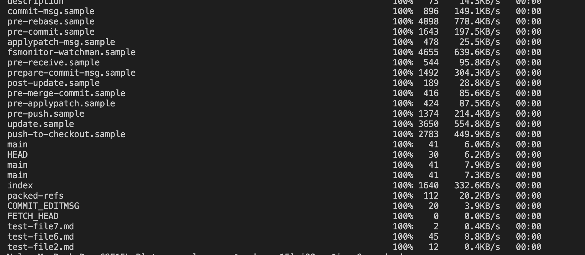
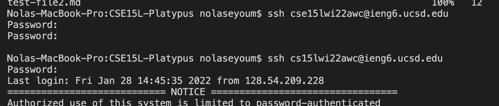
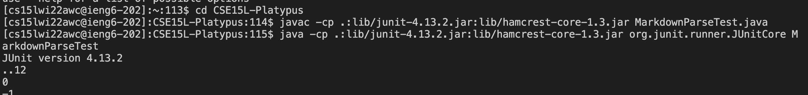
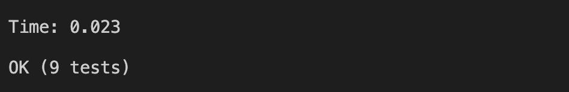
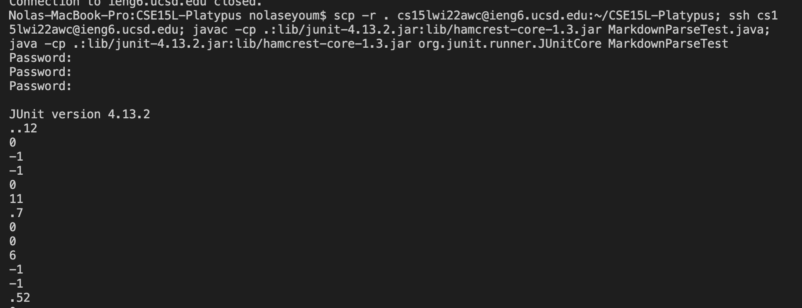

**Copying My Markdown-Parse Directory to ieng6**

In order to work on our directory logged in to the remote server, we have to copy the directory onto to the server, which `scp` does recursively.

.

.

.

**Logging Into ieng6 and Compiling/Running Tests**

Once the directory is copied onto the server, we can log in and compile and run our tests.

**Copying and Running the Tests in One Line**

To shorten the process of copying the directory and then running the tests, all of the commands can be written in one line.

