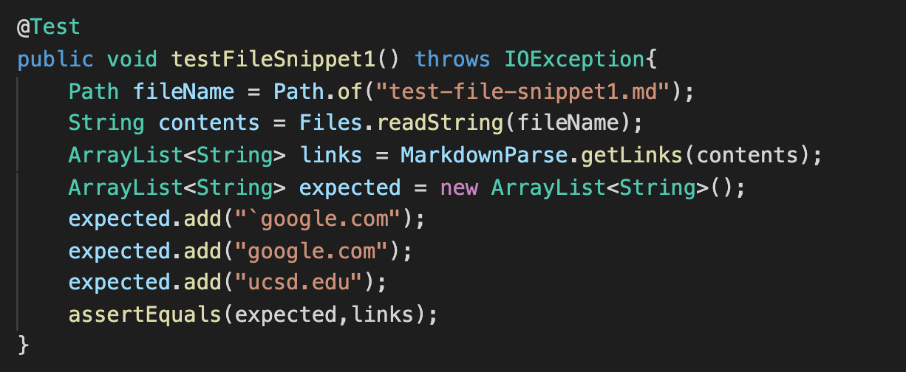
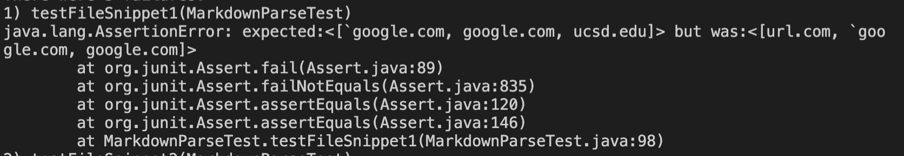
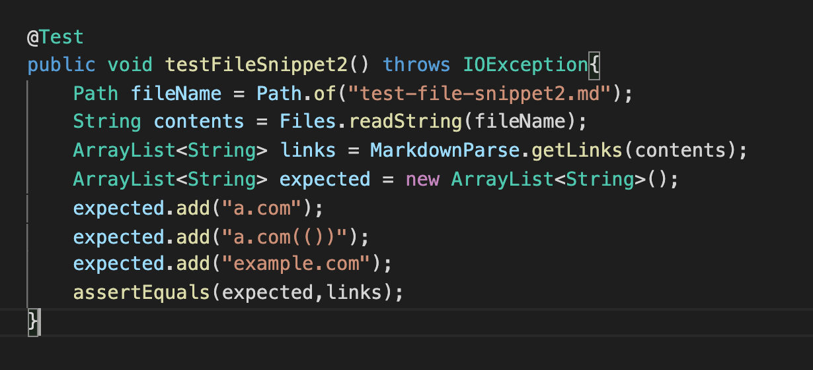
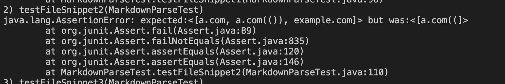
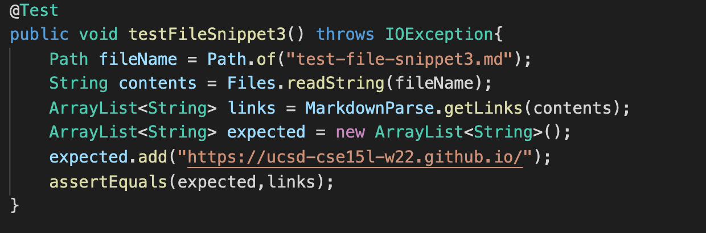
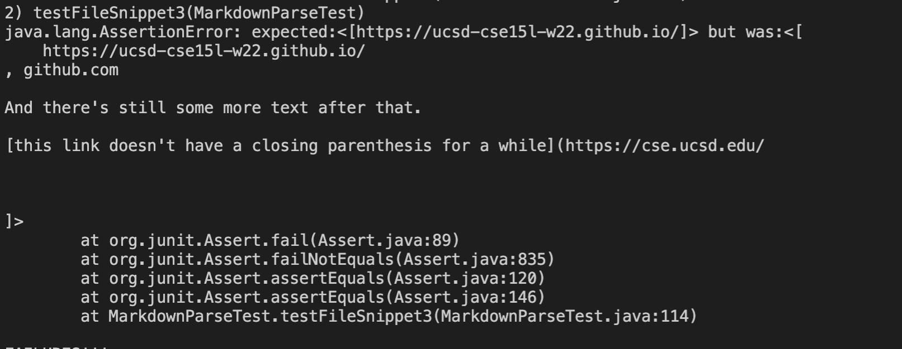
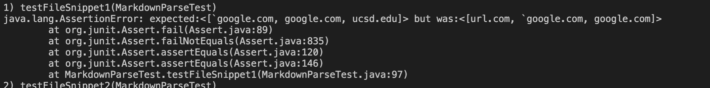
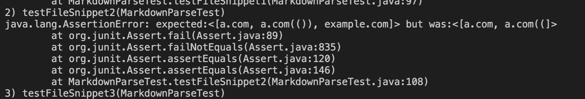
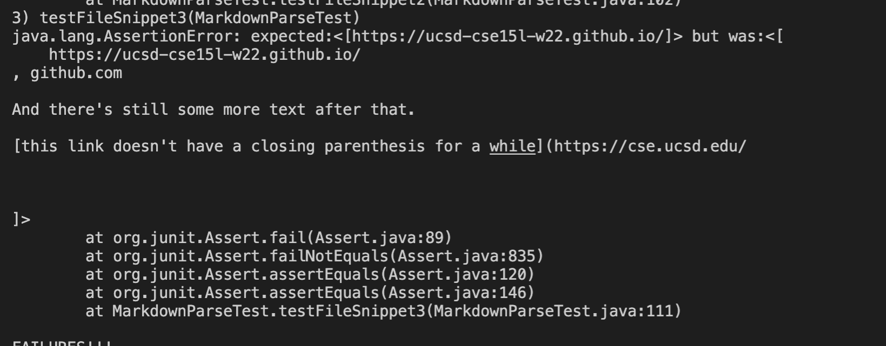

## My Markdown-Parse Repository

[link to repository](https://github.com/nseyoum/CSE15L-Platypus)

**Code Snippet 1**

1. How I turned it into a test

2. Output of Running Tests

3. Can it be fixed in <10 lines?

I think there is a code change that could help with code having inline backticks but it might be more than 10 lines. My initial thought process would be to first check the index of backticks and if it's -1, proceed to the next check. If there are backticks present, you'd have to check if it's within the attempt to initialize a URL. 

**Code Snippet 2**

1. How I turned it into a test

2. Output of Running Tests

3. Can it be fixed in <10 lines?

I don't think it can be fixed in less than 10 lines. Currently there's no code that checks for multiple brackets in one line so adding those checks and then the code to check if theres parentheses within that would be more than 10 lines.

**Code Snippet 3**

1. How I turned it into a test

2. Output of Running Tests

3. Can it be fixed in <10 lines?

I think it could be fixed in less than 10 lines. In our current checks, there are if statements that check if the indices of the brackets and parentheses are to be found/in range. Nested in those if statements I think adding a check for newlines within the current indices of the brackets and parentheses could make the program work.

## The Reviewed Markdown-Parse Repository

[link to repository](https://github.com/ezhou413/markdown-parse)

*How I wrote the tests for the reviewed repository is the same as I did for my own repository, so I did not include the code snippets because it is the same as above.

**Code Snippet 1**

1. Output of Running Tests

**Code Snippet 2**

1. Output of Running Tests

**Code Snippet 3**

1. Output of Running Tests

