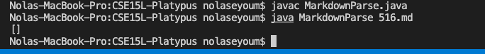

# How I Found the Tests

During the lab we learned how to put the results into a text file, so I ran the 652 tests and put the results in a text file. Since the output of each test could be seen, I skimmed through until I found ones that had text in their arrays and went to their markdown file. If the test had the wrong output in the result file or I knew that my code would fail that test, I used it.

## Test 1: File 500

The correct implementation for this test would be the one provided in the commonmark-spec tests. The expected output would be the word link three times, each linked to a different website indicated by the text inside the brackets. 

**Provided Implementation**

**My Implementation**

To find the bug I printed out my current indices and it seems like the code is starting at the wrong point. It skips the first line and catches the second and third but not the first. Below is the image of my code and the printed indices for running file 500.

## Test 2: File 516

The correct implementation for this would be my implementation. The file has the syntax to set up an image rather than a website so the expected output should be an empty array, which is what mine outputted.

**Provided Implementation**

**My Implementation**

The bug in the code is that there is no check if there is an exclamation point before the square brackets. The syntax for an image also includes square brackets and parentheses so not checking for an exclamation point before the square bracket was the cause of the bug.

